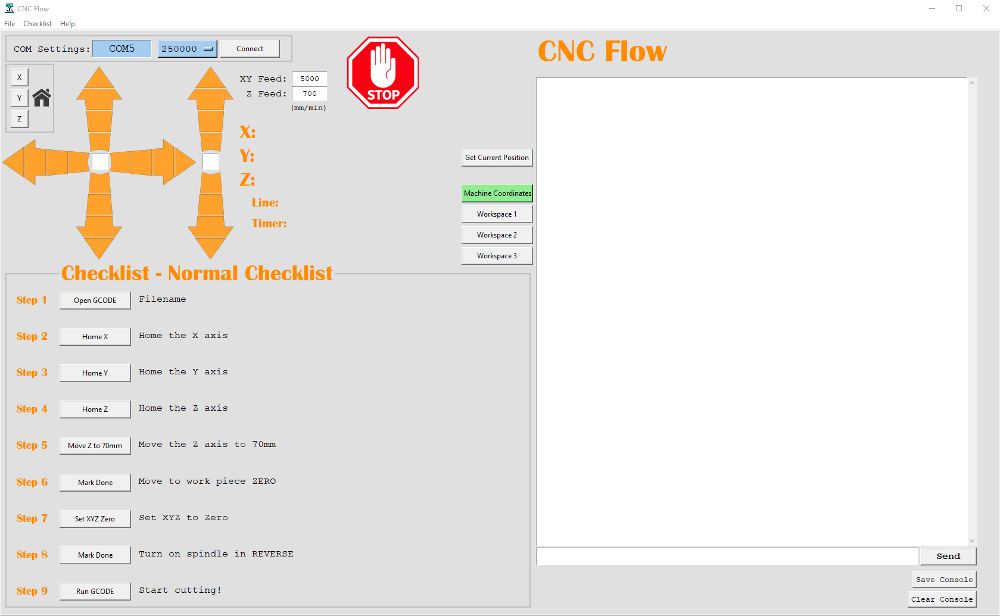

# CNC-Flow

## Description
Software for setting up CNC jobs and sending GCODE (Marlin 2.x based)

## Installation
The EXE is standalone and can just be run. You need to have "db.sqlite" and the "assets" folder in the same directory for everything to render/work.

Please see the [Wiki](https://github.com/woody9988/cnc-flow/wiki/CNC%E2%80%90Flow-Documentation) for more details
